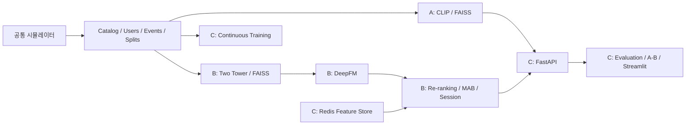

# 멀티모달 검색 및 Multi-Stage 추천 시스템

팀장이 공통 개발 기반을 구현·검증해 `chore/shared-foundation` → main PR로 먼저 병합한 뒤,
세 사람이 독립 클론에서
Codex에 단계 실행만 지시해 검색·추천·서빙을 병렬 개발한다.

| 역할 | 이름 | 담당 | Codex 입력 |
|---|---|---|---|
| A(팀장) | 이제원 | 공통 준비, 검색, 최종 통합 | `A 다음 단계 실행` |
| B | 박정욱 | Two Tower, DeepFM, 재랭킹, MAB, 세션 | `B 다음 단계 실행` |
| C | 박채영 | Redis, 평가, A/B, CT, Docker, 문서 | `C 다음 단계 실행` |

첫 입력은 `B 개발환경 준비하고 다음 단계 실행`처럼 역할을 지정한다.
Codex가 setup·브랜치 준비·구현·검증·수정·로컬 commit을 수행하고 내용을 설명한다.
사용자가 확인해 푸시·PR 생성을 허가하면 Codex가 기능 브랜치를 push하고 main 대상 PR을
생성/갱신한다. PR 병합은 CI/리뷰 확인 후 별도 허가를 받아 수행한다. main 직접 푸시는 하지 않는다.
[사람이 따라 할 시작 가이드](docs/codex_quickstart.md),
[단계별 상세 요구사항](ai_step_prompts_optimized.md),
[병렬 작업·Git 계약](docs/team_workflow.md), [브랜치·PR 절차](docs/pr_workflow.md)를 참고한다.



환경을 직접 실행할 경우 한 명령으로 준비한다.

```bash
bash setup_env.sh . --role=B
# 선택: VS Code 대화 대신 CLI에서 다음 단계 실행
bash scripts/codex_run.sh B
```

기본 setup은 직접 의존성 설치, pip check, unit/contract 테스트, 시드42의 dev 데이터·이미지 생성,
시간 분할, train/valid 진단, 고정 CLIP revision 추론, Docker 상태/Compose 설정 검사를 수행한다.
Docker Desktop/Engine 실행·GitHub 인증·Codex 로그인은 각 컴퓨터의 선행 조건이다.
생략 옵션을 쓴 항목은 미측정이다. 실제 결과는 `.team/environment.json`과 docs/results에 저장한다.
데이터/.venv/캐시/모델은 커밋하지 않고 clone 후 동일하게 재생성한다.

공통 코드에는 설정/데이터/metric/API/메모리 FeatureStore가 구현되어 있다.
검색/추천 모델은 담당 단계에서 추가하며 모델 미준비 API는 503을 반환한다.
최종 품질·latency·Docker 재현 통과는 full 데이터의 B10/B11/INTEGRATE로 판정한다.

```bash
source scripts/local_env.sh
./.venv/bin/python -m pytest -q tests
# 담당 단계 완료 뒤 전체 시스템
# docker compose up --build
```

PDF 기준과 분석: [공유 데이터·평가 계약](docs/contracts.md), [원본 문제 분석](docs/setup_analysis.md).
최종 제출 저장소: https://github.com/k-pang-2026/mm-recsys
GitHub 계정은 사용자 미제공이므로 자동으로 실명과 연결하거나 다른 사람의 커밋을 꾸미지 않는다.
