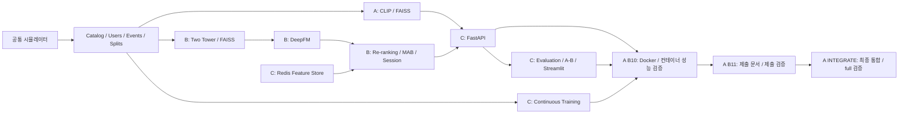

# 멀티모달 검색 및 Multi-Stage 추천 시스템

Ponytail 감사 후 생성기는 4.2로 버전이 변경되었다. 기존 4.1 이하 데이터와 모델은
덮어쓰지 않으며, 새 실행은 빈 데이터·모델 경로 또는 새 클론에서 준비한다.
기존 full 결과의 PASS는 해당 데이터·소스의 과거 실측이며 현재 버전의 새 품질 판정을 대신하지 않는다.
이번 수정의 검증 범위와 한계는 [감사 후속 보고서](docs/results/experiments/A/workflow_ponytail_refactor_20261017.json)를 따른다.
생성기 4.2 full에서 세 모델을 재학습하고 valid 동결 후 test의 수치 조건 11개와 추천 제약을
통과했다. 전체 회귀 351개·타입 검사 133파일도 통과했다. 새 A/B·자연 CT 효과를 포함한
최종 종합 판정은 `UNMEASURED`이며, [동일 입력 효율 비교](docs/results/experiments/A/workflow_ponytail_efficiency_20261017.json)는
부분 전처리·로딩 시간의 3회 중앙값이다.
이후 GitHub 병합 완료 재조회 호환성을 보완했으며, 최신 전체 회귀 **354개**와 실제 PR 재조회는
[후속 검증](docs/results/experiments/A/workflow_ponytail_merge_retry_20261017.json)에 별도 기록했다.

팀장이 공통 개발 기반을 구현·검증해 `chore/shared-foundation` → main PR로 먼저 병합한 뒤,
세 사람이 독립 클론에서
Codex에 단계 실행만 지시해 검색·추천·서빙을 병렬 개발한다.

| 역할 | 이름 | 담당 | Codex 입력 |
|---|---|---|---|
| A(팀장) | 이제원 | 공통 준비, 검색, Docker·컨테이너 성능 검증, 제출 문서, 최종 통합 | `A 다음 단계 실행` |
| B | 박정욱 | Two Tower, DeepFM, 재랭킹, MAB, 세션 | `B 다음 단계 실행` |
| C | 박채영 | Redis, 서빙, 평가·대시보드, A/B, CT | `C 다음 단계 실행` |

C는 B9까지 플랫폼 PR을 완료·병합한다. A는 검색 `feat/A/search` 이후
Docker B10을 `feat/A/docker`, 제출 문서 B11을 `feat/A/submission`,
최종 통합을 `feat/integration`에서 순서대로 수행한다.
순서는 **C B9 → A B10 → A B11 → A INTEGRATE**이며, 각 의존성은 PR 병합된 main에서 가져온다.

첫 입력은 `B 개발환경 준비하고 다음 단계 실행`처럼 역할을 지정한다.
Codex가 setup·브랜치 준비·구현·검증·수정·로컬 commit을 수행하고 내용을 설명한다.
사용자가 확인해 푸시·PR 생성을 허가하면 Codex가 기능 브랜치를 push하고 main 대상 PR을
생성/갱신한다. 기능 완료 PR은 충돌·검증·CI·품질·필수 리뷰 조건을 확인해 자동 병합한다.
푸시는 설명·허가가 필요하며, 안전한 병합은 별도 확인 없이 수행한다. main 직접 푸시는 하지 않는다.
[사람이 따라 할 시작 가이드](docs/codex_quickstart.md),
[단계별 상세 요구사항](ai_step_prompts_optimized.md),
[병렬 작업·Git 계약](docs/team_workflow.md), [브랜치·PR 절차](docs/pr_workflow.md)를 참고한다.


```mermaid
flowchart LR
  Simulator[공통 시뮬레이터] --> Dataset[Catalog / Users / Events / Splits]
  Dataset --> Search[A: CLIP / FAISS]
  Dataset --> Candidate[B: Two Tower / FAISS]
  Candidate --> Ranking[B: DeepFM]
  Ranking --> Rerank[B: Re-ranking / MAB / Session]
  Store[C: Redis Feature Store] --> Rerank
  Search --> API[C: FastAPI]
  Rerank --> API
  API --> Dashboard[C: Evaluation / A-B / Streamlit]
  Dataset --> CT[C: Continuous Training]
  API --> Docker[A B10: Docker / 컨테이너 성능 검증]
  Dashboard --> Docker
  CT --> Docker
  Docker --> Submission[A B11: 제출 문서 / 제출 검증]
  Submission --> Integration[A INTEGRATE: 최종 통합 / full 검증]
```

환경을 직접 실행할 경우 한 명령으로 준비한다.

```bash
bash setup_env.sh . --role=B
# 선택: VS Code 대화 대신 CLI에서 다음 단계 실행
bash scripts/codex_run.sh B
```

기본 setup은 직접 의존성 설치, pip check, unit/contract 테스트, 시드42의 dev 데이터·이미지 생성,
시간 분할, train/valid 진단, 고정 CLIP revision 추론, Docker 상태/Compose 설정 검사를 수행한다.
Docker Desktop/Engine 실행·GitHub 인증·Codex 로그인은 각 컴퓨터의 선행 조건이다.
생략 옵션을 쓴 항목은 미측정이다. 실제 결과는 `.team/environment.json`과 docs/results에 저장한다.
데이터/.venv/캐시/모델은 커밋하지 않고 clone 후 동일하게 재생성한다.

검색·추천·Redis/API·평가·대시보드·CT 및 B10 Docker 구현이 main에 병합되어 있다.
모델 미준비 API는 503을 반환한다. B10 full 품질/지연과 B11 제출 문서 PR #13 병합을 확인했다.
현재 INTEGRATE 브랜치에서는 라이브 Redis MAB, 새 full Docker HTTP 성능과
valid 동결 후 test 품질 재검증을 통과했다. full A/B·CT 기능 검증도 완료했으며
최종 제출 판정은 [검사 원본](docs/results/integration/submission/checks.json)을 따른다.
최종 판정과 과거 실패는 [통합 기록](docs/results/integration/report.md)으로 구분한다.

```bash
source scripts/local_env.sh
./.venv/bin/python -m pytest -q tests
```

## Docker로 전체 서비스 실행

Docker Engine/Desktop와 Compose v2 이상을 실행한 뒤 저장소 루트에서 시작한다.
`docker-compose`는 별도 설치된 구형 CLI 이름이며 아래 절차는 `docker compose`를 사용한다.

```bash
git clone https://github.com/k-pang-2026/mm-recsys.git
cd mm-recsys
docker compose up --build
# 백그라운드 실행을 원하면 위 up 대신 다음을 사용한다.
docker compose up --build -d
docker compose logs -f api-server
```

API만 준비 작업을 소유한다. 데이터 생성·검증 → 고정 revision의 CLIP 다운로드와 임베딩 →
FAISS 인덱스 → Two Tower·DeepFM·세션 학습 → Redis 프로필 warmup 순서다.
기존 데이터는 전체 manifest·이미지 checksum을 검사하고, 검색 산출물은 fingerprint와 checksum,
추천 산출물은 실제 모델 로딩으로 호환성을 확인한다. 완전한 호환 산출물만 재사용한다.
불완전하거나 다른 설정의 데이터·모델을 발견하면 보존하고 오류로 중단한다.
해당 파일을 삭제해 재시도하지 말고 새 버전의 data/model 경로를 설정한다.

| 서비스 | 로컬 주소 | 준비 상태 |
|---|---|---|
| 검색·추천 API | http://localhost:8000/docs | `/health`는 준비 중에도 200, `/ready`는 모델 로딩 완료 후 200 |
| Streamlit | http://localhost:8501 | HTTP health와 검색·추천 데모 제공 |
| Redis | localhost:6379 | ping healthcheck, 1GB 제한·allkeys-lru |
| 시뮬레이터 | 공개 포트 없음 | `/ready` 이후 생성된 이벤트를 시간순으로 API에 재생 |

준비 중 모델 API와 `/ready`는 503이다. 준비 서버에서 실제 API로 전환하는 순간에는
연결이 잠시 끊길 수 있으므로 readiness 검사는 재시도한다. 준비 실패는 API 컨테이너 종료와
로그에 표시한다. 준비와 대기 기본 제한은 각각 21,600초이며
`PREPARE_TIMEOUT_SECONDS`, `READY_TIMEOUT_SECONDS`로 조절한다.
준비 완료 뒤 다음 smoke를 실행한다. 검색 JSON·multipart 3모드, 기존·신규 사용자 추천,
실제 이벤트에 따른 세션 응답, 대시보드 HTTP를 확인한다.

```bash
docker compose exec api-server python scripts/smoke_test.py --benchmark
```

지연 검사는 각 모드 10회 warmup·100회 순차 HTTP, 후보 검색, 실제 Redis 조회의
p50/p95/p99와 원시 샘플을 기록한다. 검색/추천 200ms, 후보 100ms·300개, Redis 10ms 기준을
그대로 사용하며 미달 시 명령이 실패한다. 결과는 `docs/results/docker/smoke_dev.json`,
`docs/results/latency.json`에 남는다. HTTP 확인은 실제 브라우저 화면 검증과 구별한다.
고정 벤치마크는 초기 v1.0과 CT 재학습이 동시에 실행되지 않는 조건을 대상으로 한다.
승격된 release나 측정 중 버전 변경은 거부하며 해당 release는 별도로 평가한다.

학습·CT 로그와 새 평가는 `docs/results/docker/runtime/<scale>/`에 분리한다.
Streamlit도 이 경로를 읽으며 새 통합 평가가 없으면 미측정으로 표시하고 데모는 제공한다.
저장소의 다른 머신 평가를 새 컨테이너의 측정으로 표시하지 않는다.
기존 C 평가 CLI로 dev/valid 결과를 생성할 때는 다음과 같이 실행한다.

```bash
docker compose exec -e CONFIG_PATH=models/.docker/config.yaml api-server \
  python -m src.evaluation.run_all --split valid
```

기본 규모는 dev(상품 10,000·사용자 2,000·이벤트 200,000)다.
full은 상품 50,000·사용자 10,000·이벤트 1,000,000이며 dev와 별도 경로를 사용한다.

```bash
SCALE=full docker compose up --build -d
SCALE=full docker compose exec api-server python scripts/smoke_test.py --benchmark
```

기본 dev와 함께 full을 검증할 때는 별도 프로젝트·포트를 사용한다. B10 gate의
`mm-recsys-b10-full` 명령을 다시 실행하려면 다음과 같이 준비한다.

```bash
SCALE=full API_PORT=18000 DASHBOARD_PORT=18501 REDIS_PORT=16379 \
  docker compose -p mm-recsys-b10-full up --build -d
SCALE=full docker compose -p mm-recsys-b10-full exec api-server \
  python scripts/smoke_test.py --benchmark
```

이 경우 API·Streamlit은 각각 localhost:18000·localhost:18501이다.

full 평가 CLI의 `CONFIG_PATH`는 `models/full/.docker/config.yaml`이다.
모델 품질의 test 평가는 valid에서 선택·동결한 후 수행하며, smoke 성공만으로
full 품질이나 최종 제출 acceptance가 통과한 것으로 간주하지 않는다.
Docker 산출물에 C의 고정 평가 함수를 적용하고 Streamlit용 결과를 생성하는 B10 명령은 다음과 같다.
먼저 같은 규모의 `smoke_test.py --benchmark`가 통과해야 한다.

```bash
SCALE=full docker compose exec api-server python -m docker.quality --split valid
SCALE=full docker compose exec api-server python -m docker.quality --split test
SCALE=full docker compose exec api-server python -m docker.quality --split test --verify-existing
```

valid에서 데이터·모델·설정·평가 코드의 hash를 동결하고 test 전에 다시 검사한다.
품질 또는 지연 미달은 실패 종료한다. 원본 B/C 결과를 덮어쓰지 않고
`docs/results/docker/quality_full_{valid,test}.json`과 Docker runtime의 대시보드 파일을 만든다.
새 A/B 실험이 없으면 해당 탭은 미측정으로 유지한다. B11은 이 근거와 별도의 A/B·CT 근거를 집계한다.
오프라인 추천 품질은 B5 메모리 adapter를 사용한다. INTEGRATE는 Redis에
`arm_statistics`·`record_exposures`와 원자적 최대 보상·중복 방지·귀속 TTL을 연결했다.
[실제 full HTTP/별도 Redis 관측](docs/results/integration/mab_full.json)으로 연결을 검증했다.
[C의 인계 기록](docs/contributions/C.md)의 UNCONNECTED는 이전 측정 당시 상태이며,
오프라인 품질과 라이브 귀속 검증은 서로 다른 실행으로 구분한다.

CT 자동 재학습은 기본 네 서비스와 분리된 선택 profile이다. API의 loopback 네트워크를
공유하므로 C의 내부 reload 접근 제한을 유지한다.

```bash
docker compose -f docker-compose.yml -f docker/compose.ct.yml --profile ct up --build -d
```

시뮬레이터의 합성 이벤트는 API 도착 시각으로 처리하고 체크포인트·이벤트 ID로 중복 적용을
방지한다. 진행 위치는 Redis 상태와 함께 저장하므로 새 Redis에서 이전 서버의 이벤트를
건너뛰지 않는다. 데이터 경로의 cursor JSON은 진단용 snapshot이다.
이 재생은 추천 노출에 귀속된 실제 사용자 반응이 아니므로 CTR·HitRate 개선의
근거로 사용하지 않는다. CT는 충분한 귀속 반응이 없으면 품질을 미측정으로 유지하고,
재학습해도 validation 개선 조건을 충족해야 새 모델을 채택한다.

데이터·모델·결과는 호스트의 `data/`, `models/`, `docs/results/`에 유지한다.
Hugging Face 캐시와 Redis 상태는 named volume에 유지하므로 첫 다운로드에는 네트워크가
필요하고, 이후 동일 캐시를 재사용한다. `docker compose down`은 컨테이너만 중지·제거한다.
볼륨을 지우는 `down -v`는 별도 승인 없이 실행하지 않는다.

API 메모리는 4GB·CPU는 4개로 제한하고 Streamlit·시뮬레이터는 각각 512MB로 제한한다.
권장 호스트는 RAM 16GB·CPU 4코어·여유 디스크 50GB, Docker 메모리 8GB 이상이다.
선택 CT 학습은 API와 별도로 최대 4GB를 사용하므로 추가 메모리 여유가 필요하다.
CPU Torch 2.6.0·torchvision 0.21.0을 로컬과 이미지에 공통 사용한다.
`docker.serve:app`은 `src.search.api:app`을 그대로 사용하며 두 서비스 factory의 로딩이 끝난 뒤
학습 완료 후 새 API 프로세스가 numpy/Torch를 import하기 전에 CPU 라이브러리 초기 예산을 맞추고,
실제 추론 worker의 Torch·FAISS 스레드도 통일한다. 준비·학습 자식 프로세스의 기존 환경과 모델 가중치는 유지한다. 적용값은 runtime의 `serving_runtime.json`과 smoke에 기록한다.
Compose의 `SERVING_THREADS` 기본값은 valid에서 선택한 2다. 이를 지정하면 공유 추론
프로세스의 스레드만 바꿀 수 있으며 valid 요청으로 선택한다. Compose 밖에서는 미지정 시
`search.torch_threads`를 따른다. test 품질·정답·목표값을 바꾸지 않는다.
hybrid의 독립 텍스트·이미지 인코딩은 Docker adapter의 두 worker에서 병렬 실행한다.
기존 searcher 잠금으로 요청 간 인코딩을 직렬화하며 가중치·합성·검색은 원본을 사용한다.
어느 인코딩이 실패해도 둘 다 종료한 뒤 요청 이미지가 닫히도록 한다.
`SERVING_PARALLEL_HYBRID=0`으로 원래 순차 경로를 비교할 수 있다.
실제 CLIP valid 입력 12개의 벡터와 top10 비교는
[병렬 인코딩 검증](docs/results/docker/parallel_encoder_full.json)에 기록한다.
`SERVING_GC_FREEZE=1`은 모델 초기화 후 장수 객체를 반복 GC 스캔에서 분리한다.
임시 객체의 자동 GC는 유지하며 성공한 reload 뒤 수집·재등록하고 종료 시 해제한다.
full 진단에서 느린 요청 10개 모두 157~200ms의 세대 2 GC와 겹친 근거를 보존했다.
[Python의 freeze/unfreeze 정의](https://docs.python.org/3.11/library/gc.html#gc.freeze)를 사용하며
`SERVING_GC_FREEZE=0`으로 동일 조건의 진단을 재현할 수 있다.
`docker/constraints-*-py311-linux-arm64.txt`는 실제 Linux ARM64·Python 3.11 이미지에서
해결·검사한 의존성 제약이며 GPU 또는 다른 플랫폼에서 검증된 lock이 아니다.
다른 플랫폼은 해당 환경에서 다시 해결·검증해야 한다. Streamlit 이미지는 dashboard 의존성만
설치하며 torch·FAISS·transformers를 포함하지 않는다.

과거 B10 Linux ARM64 CPU의 full 초기 v1.0 측정(모드당 warmup 10회·순차 HTTP 100회)에서는
text/image/hybrid/recommendation p95가 각각 27.447/178.894/173.203/106.317ms였다.
후보 검색 p95는 4.967ms·최소 300개, Redis 조회 p95는 0.250ms였다.
모델·인덱스는 메모리에 로드하고 응답 캐시는 사용하지 않았으며 ONNX는 적용하지 않았다.
CT 동시 학습이 없는 조건의 결과이고 부하·머신별 보장은 아니다.
[full 원시 측정](docs/results/docker/smoke_full.json)과
[검증 결과](docs/results/docker/verified_full.json)를 참고한다.

최초 준비 시간은 CPU·캐시·산출물 존재 여부에 따라 달라진다. 실제 실행별 시간과 재사용 여부는
`docs/results/docker/runtime/<scale>/preparation*.json`에 남는다. INTEGRATE는 별도 clone의 빈 data/models에서
full 데이터·임베딩·인덱스·세 모델 준비를 2,725.892초에 완료했다. 사전 학습 CLIP 다운로드 캐시와
의존성 레이어는 재사용했으며 이미지 빌드·API 최종 로딩·최초 네트워크 다운로드 시간과 구분한다.
[실제 cold 준비](docs/results/integration/preparation_first_full.json),
[두 번의 full 생성 비교](docs/results/integration/data_reproduction_full.json)를 보존한다.

이번 Linux ARM64 CPU 환경(Docker 약 7.5GiB, API 4GiB·4 CPU)에서 측정한 준비 시간은 다음과 같다.

| 규모 | 처음 추천 모델을 학습한 준비 | 호환 산출물을 재사용한 준비 | 첫 실행의 기존 산출물 |
|---|---:|---:|---|
| dev | 439.820초 | 21.342초 | 데이터·검색 재사용, 빈 HF 캐시 다운로드 포함 |
| full | 2,698.698초 | 77.544초 | 데이터·검색·HF 캐시 재사용 |

full 첫 준비에는 별도 dev 진단과 학습 일시정지 시간이 포함된다. 이 값은 새 클론 전체 생성이나
다른 머신의 예상 시간으로 사용하지 않는다. 원본은
[dev 준비](docs/results/experiments/A/docker_first_preparation_dev.json),
[full 준비](docs/results/experiments/A/docker_first_preparation_full.json)에 보존했다.
재사용 시간의 원본도 [dev](docs/results/docker/preparation_reuse_dev.json),
[full](docs/results/docker/preparation_reuse_full.json)에 별도로 보존했다.

PDF 기준과 분석: [공유 데이터·평가 계약](docs/contracts.md), [원본 문제 분석](docs/setup_analysis.md).
최종 제출 저장소: https://github.com/k-pang-2026/mm-recsys
GitHub 계정은 사용자 미제공이므로 자동으로 실명과 연결하거나 다른 사람의 커밋을 꾸미지 않는다.

## 제출 문서와 현재 상태

Python·PyTorch·transformers CLIP·FAISS CPU·FastAPI·Redis·Streamlit·Docker Compose를 사용한다.
주요 코드는 `src/common`(계약/설정), `src/simulator`(합성 데이터), `src/search`,
`src/recommendation`, `src/serving`, `src/evaluation`, `src/ct`에 있고,
`dashboard/`, `docker/`, `scripts/`, `tests/`, `docs/`가 실행·검증·보고서를 담는다.
직접 의존성은 requirements 파일, 공통 seed/규모/목표는 config YAML로 관리한다.

| 역할·이름 | 완료된 주요 기여 | 실제 병합 PR | GitHub handle |
|---|---|---|---|
| A 이제원 | 공통 기반·시뮬레이터·검색·워크플로·Docker·B11 제출 문서 | [#1](https://github.com/k-pang-2026/mm-recsys/pull/1), [#2](https://github.com/k-pang-2026/mm-recsys/pull/2), [#3](https://github.com/k-pang-2026/mm-recsys/pull/3), [#5](https://github.com/k-pang-2026/mm-recsys/pull/5), [#7](https://github.com/k-pang-2026/mm-recsys/pull/7), [#12](https://github.com/k-pang-2026/mm-recsys/pull/12), [#13](https://github.com/k-pang-2026/mm-recsys/pull/13) | 미등록 |
| B 박정욱 | Two Tower·ANN·DeepFM·재랭킹·MAB·세션 | [#4](https://github.com/k-pang-2026/mm-recsys/pull/4), [#8](https://github.com/k-pang-2026/mm-recsys/pull/8) | 미등록 |
| C 박채영 | Redis/API·A/B·평가·Streamlit·CT | [#6](https://github.com/k-pang-2026/mm-recsys/pull/6), [#9](https://github.com/k-pang-2026/mm-recsys/pull/9), [#10](https://github.com/k-pang-2026/mm-recsys/pull/10), [#11](https://github.com/k-pang-2026/mm-recsys/pull/11) | 미등록 |

담당 역할과 PR의 실제 head SHA는 [기여 근거](docs/submission/contributions.json)에 있다.
작성자 계정으로 개인 신원을 추측하지 않는다. B11 PR #13은 승인된 head로 병합했다.
INTEGRATE의 구현·실측은 현재 기능 브랜치에서 진행하며, 미래 원격 반영을 완료된 기여로 집계하지 않는다.

- [요구사항→파일→검사→실제 결과](docs/submission/requirements.md)
- [수식·baseline·full 품질·환경·제한](docs/submission/report.md)
- [A/B 통계와 음의 lift](docs/ab_test_report.md)
- [새 클론·Compose·curl·제출 검사 절차](docs/submission/reproduction.md)
- [제출 체크리스트와 INTEGRATE 인계](docs/submission/checklist.md)
- [설정/데이터/측정 identity snapshot](docs/submission/config_snapshot.json)
- [최종 acceptance 집계](docs/results/final_acceptance.json)

```bash
source scripts/local_env.sh
SCALE=full PYTHONHASHSEED=42 .venv/bin/python scripts/check_submission.py \
  --verify-existing --require-ready --output-dir docs/results/integration/submission
```

이 명령은 저장된 INTEGRATE 결과·소스·원시 지연·실행 근거를 재검증하며 새 모델 측정이 아니다.
최종 결과가 생성되기 전에는 미완료/누락으로 실패한다. 최종 판정은 `final_acceptance.json`을 따르며
구조 검증과 구분한다. 과거 B11 검사는 `final_submission/` 원본으로 보존했다.
full valid/test 품질·A/B 통계 재검산·CT 기능 검증을 마쳤다. 최종 제출 판정은 별도 checker 원본을 따른다. 라이브 Redis MAB와 cold 준비·성능은 새 원본에 기록했다.
P0는 사용자 전달 강사 결정에 따라 RESOLVED_OPTIONAL이며, 실제 데이터셋은 개발 후 추가 검증용이다.
[결정 원본](docs/submission/dataset_scope.json)과 [데이터 출처](docs/data_sources.md)를 확인한다.
원격 접근은 [확인 시각의 read-only snapshot](docs/results/final_submission/repository.json)이며,
과제 시스템에 URL을 제출하거나 공개 범위를 변경하는 작업은 수행하지 않았다.


## INTEGRATE의 추론 실행 경로

기본 CPU API는 `SERVING_OPTIMIZE_VISION=1`로 같은 pinned FP32 CLIP vision graph를
시작 시 최적화한다. 전처리·가중치·합성·FAISS는 유지하며 응답 cache나 양자화는 사용하지 않는다.
입력 processor의 batch-one 3×224×224 경로를 사용하고 비표준 encoder 호출은 원본으로 처리한다.
`SERVING_OPTIMIZE_VISION=0`은 비교용 eager 경로이며 해당 경로의 최종 지연 통과를 보장하지 않는다.
query cache에는 구현·shape·실제 추론 시작 환경이 포함되고, Docker 품질 CLI도 같은 query 경로를 평가한다.
[valid 이미지/hybrid 400개](docs/results/integration/vision_parity_full_valid.json)의 top10은 모두 같았으며
최대 정규화 벡터 차이는 약 0.00000212였다. FP32 연산 재배치의 수치 오차이며 bit-exact라고 주장하지 않는다.

새 full HTTP p95는 text/image/hybrid/recommendation 36.767/123.496/118.009/54.323ms다.
각 모드 warmup 10회·100회 순차 호출이며 [원시 측정](docs/results/integration/smoke_full.json)과
[원시 표본 재검사](docs/results/integration/verified_full.json)를 보존한다.
최초 image/hybrid 220.594/225.821ms 및 graph만 적용한 hybrid 203.340ms 실패도
`docs/results/integration/attempts/`에 남겼다. 학습/CT/A-B 동시 부하에서의 p95 보장이 아니다.

generator 4.1.0은 생성에 영향을 주는 YAML mapping 순서를 fingerprint에 포함한다.
이전 4.0.0 데이터/모델은 보존하고 새 clone 또는 새 버전 경로를 사용한다.
이번 검증의 로컬 artifact 별칭은 [재현 문서](docs/submission/reproduction.md)를 따른다.
기본 새 clone의 `docker compose up --build`는 canonical config 경로에서 재생성한다.


현재 INTEGRATE 측정을 별도 경로에 기록하려면 동일한 full 프로젝트에서 다음을 사용한다.
`RUNTIME_RESULTS_DIR=docs/results/integration/runtime`으로 시작한 프로젝트의 예시이며,
기존 B10 결과를 새 측정으로 덮어쓰지 않는다.

```bash
SCALE=full RUNTIME_RESULTS_DIR=docs/results/integration/runtime docker compose exec api-server \
  python scripts/smoke_test.py --benchmark --output docs/results/integration/smoke_full.json
SCALE=full RUNTIME_RESULTS_DIR=docs/results/integration/runtime docker compose exec \
  -e QUALITY_RESULTS_DIR=docs/results/integration api-server python -m docker.quality --split valid
SCALE=full RUNTIME_RESULTS_DIR=docs/results/integration/runtime docker compose exec \
  -e QUALITY_RESULTS_DIR=docs/results/integration api-server python -m docker.quality --split test
```

실제 새 제출 검사는 `--output-dir docs/results/integration/submission`과
`--evidence-dir docs/results/integration --integration-checks docs/results/integration/checks.json`을 지정한다.
현재 머신의 19000 API와 보존된 이전 artifact 경로를 구분하는 환경은
[재현 절차](docs/submission/reproduction.md)를 따른다. 기본 B11 인수만으로 새 INTEGRATE를 집계하지 않는다.

### full A/B와 CT의 해석

full A/B는 5,000명/arm·30일이며 CTR 상대 lift −23.73%, CVR −37.18%였다.
합성 반응 가설에서 popularity 대조군보다 낮은 결과이며 실제 사용자 개선을 주장하지 않는다.
CT 자연 재학습은 valid CTR AUC 0.971602→0.971574로 RETAINED다.
별도 full 크기의 초기 상수 ranker 기능 시나리오에서 실제 승격·재로딩·롤백을 검증했다.
운영 v1.0과 재학습 후보 가중치는 보존했고, 두 결과는 [분리된 집계](docs/results/integration/ct_acceptance_full.json)에 있다.
