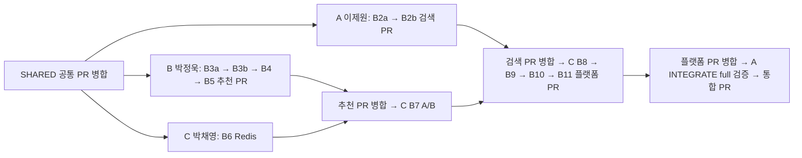

# 3인 병렬 개발과 PR 통합

PDF pp.13–14의 역할/개인 기여 요구를 사용자 요청의 3인 구성으로 구현한다.

| 역할 | 이름 | GitHub 계정 | 담당 브랜치 | 담당 단계 |
|---|---|---|---|---|
| A(팀장) | 이제원 | 미등록 | feat/A/search | 공통 SHARED, B2a/B2b, 최종 INTEGRATE |
| B | 박정욱 | 미등록 | feat/B/recommendation | B3a/B3b/B4/B5 |
| C | 박채영 | 미등록 | feat/C/platform | B6/B7/B8/B9/B10/B11 |

공통 SHARED는 팀장이 먼저 코드·설정·시뮬레이터·평가 정의·API/FeatureStore 계약·
환경/단계/Git 자동화와 검증 결과를 chore/shared-foundation → main PR로 제출한다.
공통 PR 병합 후 B/C가 main을 클론한다. 최종 INTEGRATE도 feat/integration PR로 제출한다.
세 사람은 같은 폴더를 공유하지 않고 각자의 clone/venv/cache/data를 사용한다.

이제원은 B, 박정욱은 C, 박채영은 A가 리뷰한다. PR/commit과 검증 결과에 실제 리뷰 내용을
기록한다. 실명은 사용자 제공값이고 Git 작성자/계정은 각자의 기존 설정을 사용한다.
기여 기록은 `docs/contributions/A.md`, B.md, C.md로 분리해 동시 편집 충돌을 줄인다.

## 작업과 푸시 권한

`A/B/C 다음 단계 실행`은 구현·검증·수정·기능 브랜치의 로컬 commit·PR 미리보기·내용 설명 요청이다.
사용자는 각 push 전에 작업 설명과 허가 절차를 요구했다. 사용자가 그 결과를 명시 승인한
뒤에만 기능 브랜치를 push하고 PR을 생성/갱신한다. main 직접 commit/push는 금지한다.
PR 병합은 원격 gate·CI·품질·필수 리뷰/보호 규칙과 충돌을 확인해 안전하면 자동 수행한다.
사용자가 이 자동 병합을 허가했으므로 병합을 위해 재확인을 요청하지 않는다. [PR 절차](pr_workflow.md)를 따른다.
사람에게 코드 작성/파일 목록 조립/Git 명령 입력을 넘기지 않는다.
`auto_push: false`, `push_requires_user_approval: true`,
`pull_requests.auto_merge_when_safe: true`가 현재 정책이다.
커밋은 [공통 메시지 규칙](commit_convention.md)에 따라 helper가 자동 작성한다.
형식은 `type(scope): 한국어 변경 요약`; 본문은 실제 변경 파일과 gate의 검사 근거를 한국어로 기록한다.
정상 Git 권한은 사용하며 sandbox/자동 승인 심사/원격 보호 규칙을 문서로 우회하지 않는다.

CLI는 `.team/runner.json`에서 publication_managed=true일 때 모델이 commit/push하지 않고
검증 gate와 변경 설명만 작성한다. runner가 확인 후 `step_git.py --mode commit`으로
로컬 commit·PR 미리보기를 준비하고 승인 대기에서 멈춘다. `team.py publish <role> --approved`는
사용자가 설명된 commit의 푸시·PR 생성을 명시 승인한 뒤에만 실행한다. 승인 전 이 명령을 자동 호출하지 않는다.
VS Code 대화에서는 Codex가 동일 helper를 호출한다. CLI 밖 세션 시작 시 오래된 runner 파일은
현재 CLI 실행이 아님을 확인하고 제거하되 푸시 허가는 별도로 확인한다.

## 공통 파일과 소유권

`config.yaml`, src/common, simulator, metrics.py, API schema는 SHARED에서 고정한다.
A는 src/search와 config/search.yaml, B는 src/recommendation과 config/recommend.yaml,
C는 serving/evaluation/ct/dashboard/docker와 config/serving.yaml을 편집한다.
공통 의존성/스키마 변경은 다른 팀의 adapter를 깨뜨리지 않게 검증한다. helper가 소유권 밖 변경을
검출하면 역할 overlay나 인터페이스로 해결하고, 꼭 필요한 공통 변경은 팀장 통합 단계에 반영한다.

수동 파일 목록 대신 Git의 실제 변경을 검사한다. gate가 없는 변경, 기존 staged 변경,
비밀/대용량 파일, 다른 사람 소유 파일, 테스트 후 변경된 artifact는 자동 publish를 거부한다.
source 코드와 작은 실제 결과 JSON만 푸시하고 데이터/모델은 config/seed/revision으로 재생성한다.

## 게이트

`docs/results/gates/<STEP>.json`은 record_gate.py가 실제 검사를 실행해 기록한다.
필수: step/owner/status, dev|full, acceptance, commands+exit_code, artifacts,
data_fingerprint/config_fingerprint/evaluation_version. 구조 status와 full acceptance는 구분한다.
구조 PASS/품질 FAIL은 Draft PR에서 공동 진단 가능하며 다음 단계나 병합을 진행하지 않는다.
INTEGRATE는 full acceptance PASS까지 검사한다. gate의 missing/FAIL/BLOCKED는 건너뛰지 않는다.
구조 PASS라도 acceptance FAIL이면 다음 단계는 같은 단계다. 원인 수정 후 valid 실험과
검증을 재실행한다. CLI 중단 후 담당 브랜치에 미완료 코드가 남으면 소유권/의존성을 확인해
그 작업을 이어간다. 다른 역할의 미완료 파일을 지우거나 임의로 브랜치를 전환하지 않는다.

## 실행·재개

사람이 읽고 복사할 것은 [Codex 시작 가이드](codex_quickstart.md)의 짧은 지시뿐이다.
`config/team_workflow.yaml`이 owner/순서/의존성/branch/file scope의 기계 판독 기준이다.
같은 역할의 이전 단계는 자신의 브랜치에서 이어간다. 다른 역할의 필요한 gate는 origin/main에
PR 병합되어 있어야 한다. 검토된 main을 자동 fetch/merge하고 미검토 기능 브랜치는 가져오지
않는다. 충돌은 Codex가 수정·재검증한다.
푸시 실패 시 해당 commit을 보존하고 같은 명령의 재실행으로 이어간다.
GitHub auth/login·보호 규칙·Docker host 설정은 권한이 없을 때 정확한 조치만 요청한다.

CI 진행 중이면 최대 10분 기다린다. 아직 완료되지 않으면 `.team/pr/merge_pending.json`에
PR 번호와 푸시한 SHA를 보존한다. `B 병합 상태 확인하고 계속 진행` 또는 `team.py merge B`로
재개한다. CLI의 `run`도 pending 병합을 먼저 확인한다. 충돌·검사 실패·품질 미달·리뷰 변경 요청은
자동 병합하지 않는다. BLOCKED 상태의 `run`은 같은 담당 단계의 원인을 수정·재검증한다.
수정으로 새 commit이 생기면 기존 푸시 전 설명·허가 규칙을 다시 적용한다.
